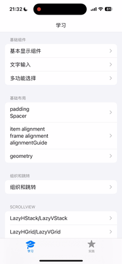
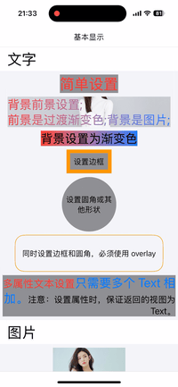
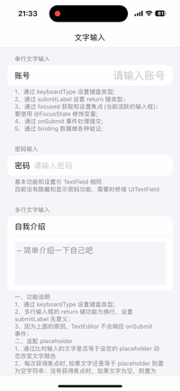
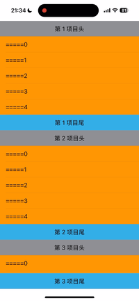
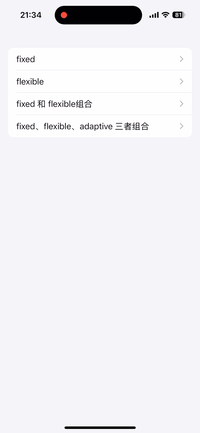
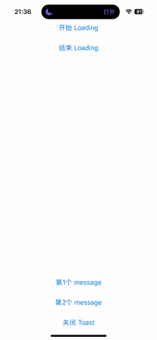

# SwiftUIAPP
SwiftUI 学习和实践 App。基本覆盖 iOS 开发常用的控件和常见的业务场景，欢迎补充。
下载项目到本地，cd 进入 Podfile 所在目录，执行 pod install 命名安装 pods 库，运行查看app效果。
# 预览
* 架构

&nbsp;
&nbsp;
* 基础控件

* 输入

* 自定义列表

* 集合视图

* 轮播图

* 分页视图

* 网络图片列表

* 上拉下拉刷新

* Toast

